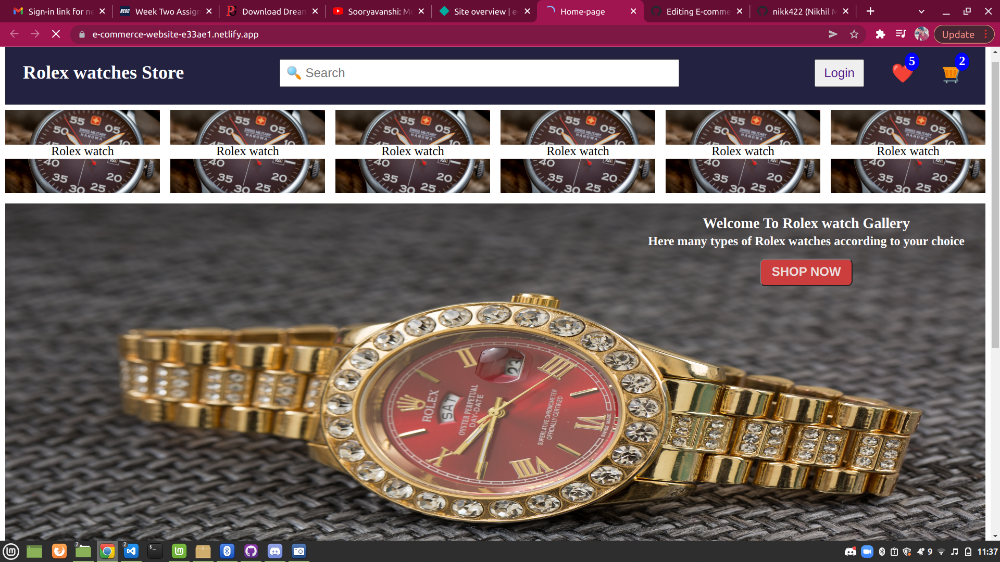

# E-commerce-macro-project
This is a simple E-commerce website created using just html and css

## Technologies Used :
- HTML
- CSS

# Home Page Preview :

## Available Componants: 
- [Login Page](https://e-commerce-website-e33ae1.netlify.app/login-page/sign-in)
- [Sign-up Page](https://e-commerce-website-e33ae1.netlify.app/sign-up/sign-up)
- [Wishlist Page](https://e-commerce-website-e33ae1.netlify.app/whishlist/wishlist.html)
- [My cart page](https://e-commerce-website-e33ae1.netlify.app/my%20cart/cart.html)
- [home Page](https://e-commerce-website-e33ae1.netlify.app/index.html)
 

## Author: [Nikhil Malviya](https://github.com/nikk422)
